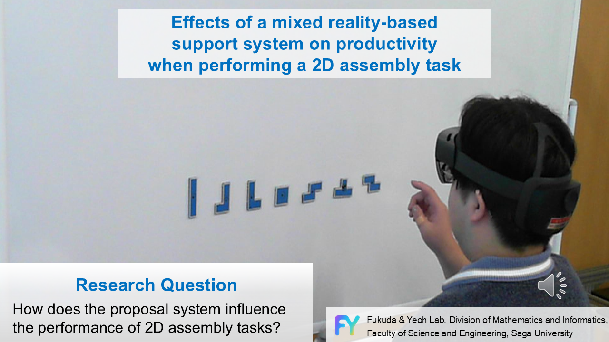

## About Me
佐賀大学大学院  修士1年 情報工学専攻 (2027年3月修了見込み) 
モノづくり工房でアルバイトをしており、小型建機の開発や体験型什器などさまざまなモノづくりをしています。

## 🔬 研究紹介 (Research) 
### 所属研究室 
[福田・YEOH研究室](https://cps.ip.is.saga-u.ac.jp/)  
### テーマ
**複合現実を用いた組み立て作業支援システムが二次元組立作業に及ぼす影響**  

[YouTubeで見る](https://youtu.be/XVHCudhtdko?si=wegUWTtbsIYSvQMw)

## 🛠️ 技術スタック (Skills)

### 開発経験あり (Practical Experience)
インターンやアルバイト、個人開発で使用経験があります。 

 
### 授業で学習 (Studied in Class)
授業や基礎学習で触れた経験があります。 

## 🏢 アルバイト (Part-time Job)
**中山ホールディングス [佐賀大deラボ](https://www.ncjpn.com/)** (2022年3月 ~ 現在)
> 佐賀大生が運営するものづくり工房です。

* **機材サポート**: 佐賀大生向けに3Dプリンタやレーザー加工機といった機材の貸し出し・技術サポート
* **共同開発**: 企業と連携した「小型建機」の遠隔操作システム等の開発
* **イベント出展**: 県庁からの依頼による製作物の展示・運営
* [公式X (Twitter)](https://x.com/saga_u_delab)

## 📂 ポートフォリオ (Portfolio)
詳細な実績はこちらにまとめています。
 
[👉 ポートフォリオを見る (Google Drive)](https://drive.google.com/file/d/1DHrgED8xXBUWiZEBOKLxjEnyTC4qSj_a/view?usp=sharing)

## 🚀 展示会・イベント (Exhibitions)
### 研究室
* 2024 [未来ものづくりEXPO2024](https://cps.ip.is.saga-u.ac.jp/?p=2822)
### アルバイト　
* 2025 [SAGAものスゴフェスタ11](https://www.sagamonosugofesta.info/)
* 2025 [デジタル実証フィールドさが](https://www.sagajikan.com/event/4534/)

* 2023 [SAGAものスゴフェスタ9](https://www.sagamonosugofesta.info/)
* 2022 [SAGAものスゴフェスタ8](https://www.sagamonosugofesta.info/)
